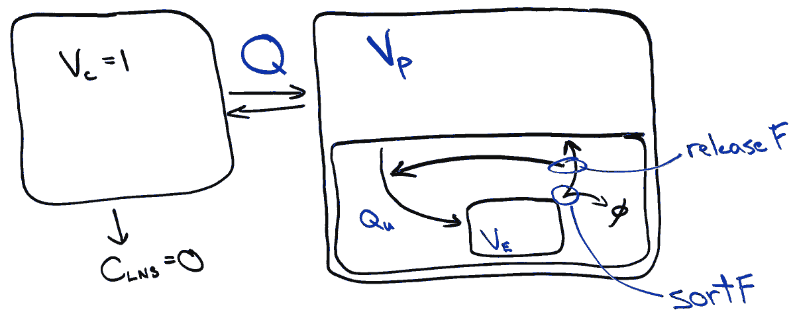

```{r, message=TRUE, include=FALSE}
library(rstan)
library(magrittr)
load('samples.rds')
load('predictions.rds')
```

As we discussed, it's challenging to infer what the exact conditions of FcRn engagement are within the endosome and at the cell surface. Therefore, here I've assembled a purely phenomenological trafficking model. This model, therefore, doesn't directly employ the binding measurements. However, by comparing the results here to those binding measurements we can come up with how they correspond.



I've made a couple assumptions here for the sake of modeling: That there is no nonspecific clearance—i.e. that the only clearance is through cell uptake and failed recycling. Relaxing this is possible and wouldn't change the results very much. All the volumes are scaled to the central compartment volume, but this doesn't change the results outside of the units. Recycling versus endosomal degradation is assumed to occur according to a sorting parameter `sortF`. Inherent in this is the assumption that FcRn-mediated recycling is not saturated by the experiment. Making saturation possible is feasible but would make the model considerably more complex. Release or recapture is partitioned through another parameter `releaseF`, and recycled IgG that is not released ends up back in the endosome. Finally, sorting and release are assumed to vary in the same order as their affinities—i.e. recycling of the pH 5.8 higher affinity IgG is assumed to be greater than the lower affinity one, and IgG with no measurable pH 7.4 affinity is assumed to be fully released.

\cleardoublepage

This data was then fit to the PK studies data using `stan`. Rather than a local sensitivity analysis, I've employed Markov Chain Monte Carlo, which is a Bayesian approach that fully samples the model posterior. While computationally much more expensive, this provides the most rigorous confidence intervals for each parameter. I've included the overview output below which most importantly shows that the fitting process worked and came to convergence (e.g. Rhat < 1.1).

```{r}
print(fit, pars = c("sortF_wt", "sortF_ls", "sortF_dhs", "releaseF_ls"),
      include = F, probs = c(0.025, 0.25, 0.75, 0.975))
```

Looking at the posterior confidence intervals:

```{r, fig.height=4, fig.width=5}
stan_plot(fit, pars = c("Vp", "Qu", "Vin", "actual_sortF_wt",
                        "actual_sortF_dhs", "actual_sortF_ls", "sortF_yte",
                        "actual_release_ls", "releaseF_yte"))
```

These results provide a few observations: Changing the pH 5.8 affinity from 111 nM to 55 nM only corresponds to a small increase in IgG recycling. This is in contrast to the WT to DHS change of 550 nM to 111 nM where sorting is greatly affected.

It makes sense that further affinity enrichment in the endosome should have diminishing returns with respect to the sorting fraction since a greater fraction of IgG becomes bound. Looking across the `sortF` parameters, this suggests the effective concentration of endosomal IgG is around 500 nM. Interpreting this as the actual endosomal concentration, though, would require assuming that the endosomal compartment comes to equilibrium.

While we don't have an exact estimate for the amount of LS IgG recaptured, the 95% confidence bound is that it's greater than 30% (note: 1 - releaseF).

Lastly, I've plotted the predicted half-life for a particular sorting and release fraction below, taking into account the uncertainty of the previous fitting. The plot shows the prediction's 50% and 80% prediction intervals.

```{r}
output <- dplyr::mutate(output, halfl = halfl/24) %>%
  dplyr::group_by(sortF, releaseF) %>%
  dplyr::summarize(lwra = quantile(halfl, 0.25),
                   upra = quantile(halfl, 0.75),
                   lwr = quantile(halfl, 0.1),
                   upr = quantile(halfl, 0.9)) %>%
  dplyr::ungroup()


ggplot2::ggplot(output, ggplot2::aes(x = sortF, color = as.factor(releaseF), group = releaseF)) +
  ggplot2::geom_ribbon(ggplot2::aes(ymin = lwr, ymax = upr, fill = as.factor(releaseF)),
                       linetype = "blank",
                       alpha = 0.3) +
  ggplot2::geom_ribbon(ggplot2::aes(ymin = lwra, ymax = upra, fill = as.factor(releaseF)),
                       linetype = "blank",
                       alpha = 0.6) +
  ggplot2::xlim(0, 1) +
  ggplot2::theme_bw() +
  ggplot2::xlab("Sorting fraction") +
  ggplot2::ylab("log10(Half life in days)") + 
  ggplot2::scale_y_log10()
```

What this shows most clearly is that both parameters matter. As soon as you've optimized the endosomal sorting, surface release becomes a much more critical factor.
